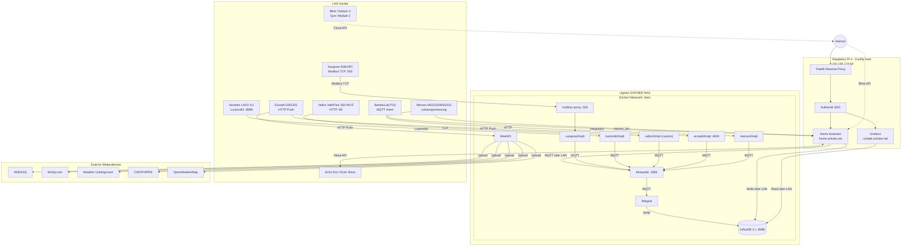

# Architektur

## Inhaltsverzeichnis

- [Kontext](#kontext)
- [Leitprinzipien](#leitprinzipien)
- [Subdomains und Begründung](#subdomains-und-begründung)
- [Laufzeitarchitektur](#laufzeitarchitektur)
- [Architekturdiagramm](#architekturdiagramm)
- [Datenfluss](#datenfluss)
- [Energiefluss-Visualisierung](#energiefluss-visualisierung)
- [Wetterdaten-Freigabe](#wetterdaten-freigabe)
- [Netzwerk- und Sicherheitsmodell](#netzwerk-und-sicherheitsmodell)
- [Warum nur eine InfluxDB-Instanz auf dem NAS](#warum-nur-eine-influxdb-instanz-auf-dem-nas)

## Kontext

Lares ist eine lokal orientierte Smart-Home-Zentrale mit MQTT als Integrationsbus, Home Assistant als Steuerungs- und Automationskern, Grafana für Visualisierung und InfluxDB auf dem NAS für Langzeitspeicherung.

Der Raspberry Pi 4 dient als zentrale Laufzeitumgebung für die Integrationsdienste. Das Ugreen NAS übernimmt den Schwerpunkt Datenspeicherung.

## Leitprinzipien

- Lokal-first: Steuerung und Datenfluss im LAN priorisieren
- MQTT-first: einheitlicher Integrationsbus für heterogene Protokolle
- Funktionsorientierte Domains: Namen beschreiben Aufgabe, nicht Tool
- Security-by-default: internet-erreichbare Oberflächen nur mit Authentik-Schutz
- Niedrige Komplexität: nur eine produktive InfluxDB-Instanz (auf NAS)

## Subdomains und Begründung

| Subdomain | Service | Zweck | Begründung |
|---|---|---|---|
| `home.schubs.net` | Home Assistant | Bedienung, Automationen, Integrationslogik | Bereits etabliert; semantisch klar für Heimsteuerung |
| `cockpit.schubs.net` | Grafana | Monitoring, Trends, technische Übersicht | "Cockpit" transportiert Instrumenten- und Übersichtsgedanken |

Hinweis: Die Benennung bleibt bei internem Toolwechsel stabil und folgt dem Funktionsprinzip.

## Laufzeitarchitektur

- Reverse Proxy und Authentik laufen auf dem Pi (Coolify-Umfeld, 192.168.178.69).
- Home Assistant und Grafana werden via Coolify auf dem Pi betrieben und sind internet-erreichbar (home.schubs.net, cockpit.schubs.net).
- Alle Integrationsdienste laufen auf dem NAS (192.168.178.163): Mosquitto, alle MQTT-Bridges, WeeWX, Telegraf, InfluxDB (ADR-014).
- Home Assistant auf Pi kommuniziert über LAN mit MQTT-Broker auf NAS.
- Protokollspezifische Bridges binden Geräte an MQTT an.
- Meross-Integration ist dual-path: `meross_lan` in HA für Steuerung, `meross2mqtt` für direkte Energiemetriken zu MQTT/InfluxDB.
- Telegraf schreibt MQTT-Metriken (inkl. Meross) lokal in InfluxDB auf dem NAS.
- WeeWX übernimmt die Weiterleitung von Wetterdaten an externe Wetterdienste.
- InfluxDB läuft zentral auf dem NAS und wird von Home Assistant (über LAN) und Telegraf beschrieben.

## Architekturdiagramm

## Datenfluss

1. Feldgeräte liefern Rohdaten über native Protokolle an Bridges auf NAS.
2. Bridges transformieren in MQTT-Topics unter gemeinsamer Topic-Hierarchie auf NAS.
3. Home Assistant auf Pi konsumiert MQTT-Daten über LAN von NAS-Mosquitto und führt Automationen aus.
4. Home Assistant schreibt Messwerte über LAN in InfluxDB auf dem NAS.
5. Telegraf auf NAS schreibt MQTT-Metriken lokal in InfluxDB auf dem NAS.
6. Grafana auf Pi visualisiert aus InfluxDB auf NAS über LAN.
7. Ecowitt-Daten werden parallel über WeeWX auf NAS an externe Wetterdienste veröffentlicht.

## Energiefluss-Visualisierung

Energieflüsse werden in zwei Oberflächen dargestellt:

- Home Assistant Energy Dashboard (`home.schubs.net`) für täglichen Betrieb
- Grafana mit Sankey-Diagramm (`cockpit.schubs.net`) für detaillierte Flussanalysen

Energiebezogene Datenpunkte umfassen:

- Sungrow: PV-Erzeugung, Batterie (Laden/Entladen), Netzbezug, Einspeisung
- Novelan: Verbrauchswerte der Wärmepumpe (soweit verfügbar)
- Meross: Lasten von BambuLab P1S, Arbeitstisch, Waschmaschine, Trockner

## Wetterdaten-Freigabe

Für die externe Nutzung der Wetterdaten wird ein zweiter Pfad genutzt:

- Primär lokal: `Ecowitt -> ecowitt2mqtt -> MQTT -> Home Assistant`
- Parallel extern: `Ecowitt -> WeeWX -> Wetterdienste`

Dadurch bleiben lokale Automationen unabhängig und externe Veröffentlichungen klar gekapselt.

## Netzwerk- und Sicherheitsmodell

- Interne Dienste (MQTT, Bridges) sind nicht internet-erreichbar.
- Grafana und Home Assistant sind internet-erreichbar, aber durch Authentik abgesichert.
- Das NAS bleibt ohne direkte Internetexposition.
- MQTT-Zugriff von extern ist standardmäßig deaktiviert.

## Warum nur eine InfluxDB-Instanz auf dem NAS

Entscheidung: direkte Speicherung auf NAS-InfluxDB statt doppelter Influx-Topologie.

Begründung:

- Weniger Betriebs- und Replikationskomplexität
- Keine Split-Brain- oder Sync-Probleme
- Datenspeicher liegt dort, wo ohnehin Langzeitbetrieb vorgesehen ist
- Pi und NAS sind im selben LAN, daher ist direkte Kommunikation technisch einfach

Trade-off:

- Bei NAS-Ausfall werden kurzfristig keine neuen Zeitreihen geschrieben.
- Steuerung und Automationen in Home Assistant bleiben davon unabhängig funktionsfähig.
